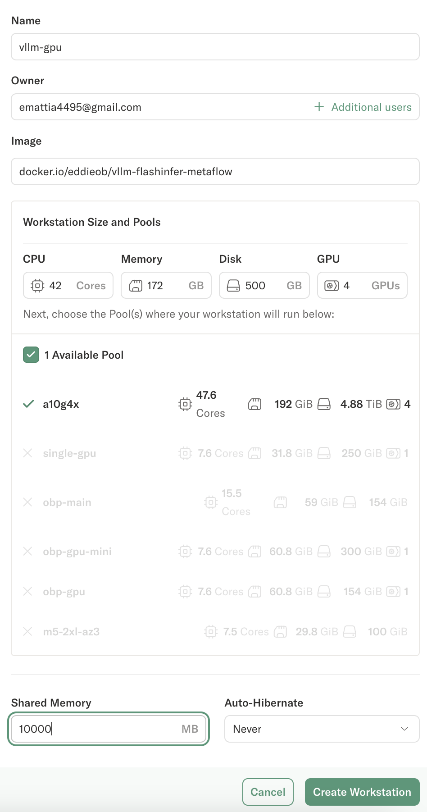
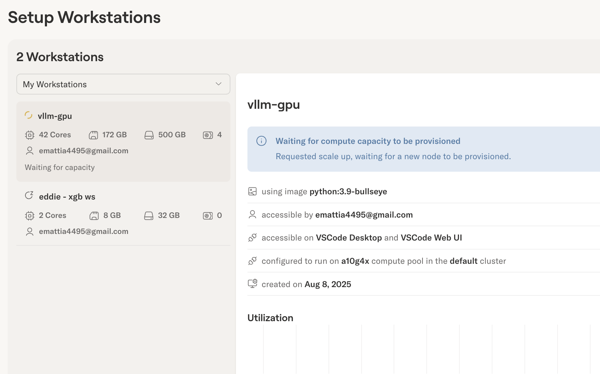

## Step 1. Create a vllm-enabled workstation

To run a 32B model, use a compute pool with a 4 GPU instance, such as `g5.12xlarge` on AWS.
Noitce a few things:
1. The setting for shared memory is 10GB, the default is insufficient IPC across GPU cards with vLLM.
2. Use an image that has Nvidia GPU drivers installed. This repository contains an [example image](./Dockerfile) that pre-installs vllm, PyTorch, and other dependencies. A public image is hosted at `docker.io/eddieob/vllm-flashinfer-metaflow` for demo purposes. 




## Step 2. Run vLLM 

The image mentioned in the previous section already has `vllm` installed.
If you opt to bring your own image, please ensure you have `vllm` installed in the active environment.

### Run the OpenAI-compatible server

Choose your model and [inference server parameters](https://docs.vllm.ai/en/latest/serving/openai_compatible_server.html).

```bash
vllm serve Qwen/Qwen3-32B --tensor-parallel-size 4
```

Gated HuggingFace models will require setting the `HF_TOKEN` environment variable to pull. 
The initial load and model compilation can take around 10 minutes for larger models. 

### Query the server

```
curl -X POST http://localhost:8000/v1/chat/completions \
  -H "Content-Type: application/json" \
  -d '{
    "model": "Qwen/Qwen3-32B",
    "messages": [
      {"role": "user", "content": "Hello, how are you?"}
    ],
    "temperature": 0.7,
    "max_tokens": 100
  }'
```
